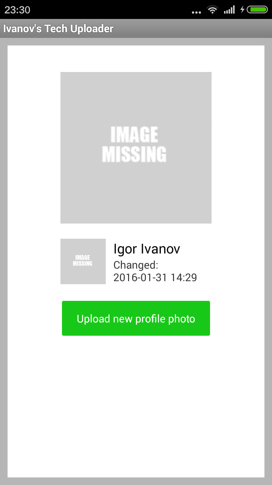
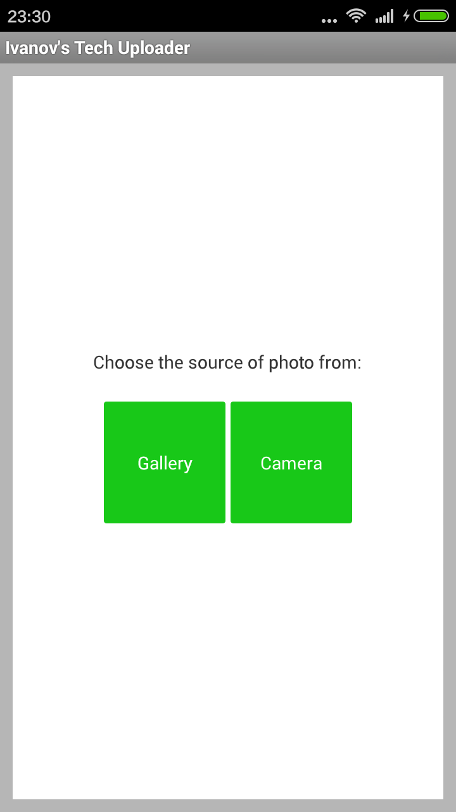
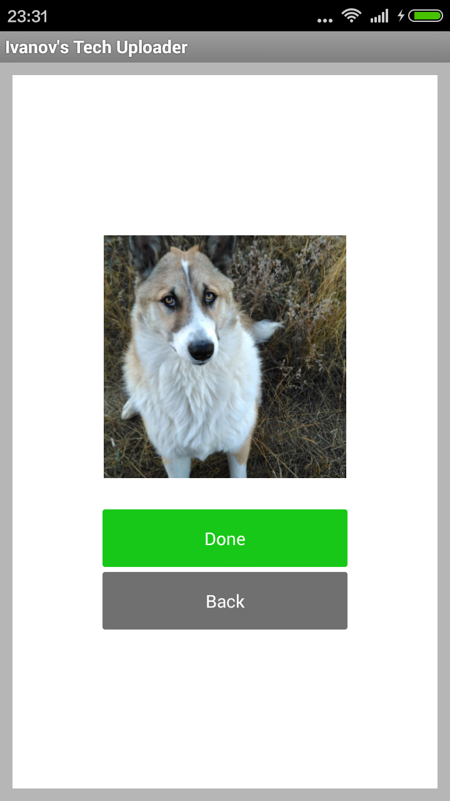
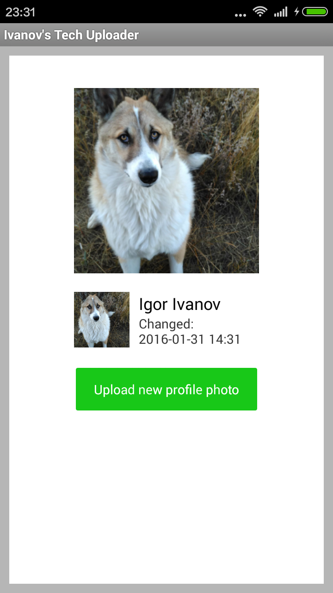

Uploader
==========

Андроид библиотека для отправки фотографий через HTTP POST на сервер. Реализованы диалоги для выбора фотографии из галереи, подтверждение и предварительный просмотр. Также проверка доступности интернета, диалоги ошибки сети.

Пример использования:
---------------------
Код использования библиотеки:

```java

import com.android.volley.toolbox.Volley;
import com.ivanov.tech.session.Session;
import com.ivanov.tech.uploader.PhotoMultipartRequest;
import com.ivanov.tech.uploader.Uploader;

...

//Запуск протокола выбора и отправки фотографии на сервер
Uploader.protocolChooseAndUpload( getActivity(), getFragmentManager(), mParams,	new Uploader.UploadListener(){

		@Override
		public void onUploaded() {
				//Фотография была выбрана и отправлена на сервер
				...
		}
						
		@Override
		public void onCancelled() {
				//Отмена
		}
			
});
	
```
**Аргументы:**

* `getActivity` - контекст активити
* `getFragmentManager` - `supportFragmentManager` из actionbarsherlock (Внимание! Не путайте с нативным getFragmentManager)
* `R.id.main_container` - передается layout используемый в качестве окна активити, тогда диалог будет показан на весь экран. Если передать другой layout, то в качестве окна диалога будет использован переданный вами layout
* `mParams` - Параметры HTTP POST запроса:
  ```java
  private static final String FILE_PART_NAME = "image";//Метка нужная на сервере
  private static final int[]  SIZE= {600,600};//Размер отправляемого по HTTP POST изображения
  private static final String URL_POST_AVATAR_UPLOAD="http://yourserver.com/v1/avatars/upload";//Url скрипта на сервере
  
  //Параметры HTTP POST запроса
  private static final PhotoMultipartRequest.Params mParams = new Params()  {
	    				
	  @Override
  	public String getPartName() {
  	  return FILE_PART_NAME;					
	  }
	
	  @Override
  	public int[] getSize() {
  	  return SIZE;
	  }
	
	  @Override
  	public String getUrl() {
  	  return URL_POST_AVATAR_UPLOAD;
	  }	    		

  }
  ```
* `UploadListener` - реализация интерфэйса `ProtocolListener` для обратного вызова. Поведение в случае завершения, или отмены протокола

**Описание:**



При нажатии кнопки "Upload new profile photo", вызывается `protocolChooseAndUpload` программа создает фрагмент `FragmentChooser`. Вы можете выбрать из галереи, либо перейти на камеру чтобы сделать новое фото:



в случае нажатия кнопки "Gallery" , выйдет стандартная форма для выбора фотографии из галереи. После выбора нужной фотографии, будет показан фрагмент `FragmentPreview` для предварительного просмотра перед отправкой на сервер:



Если нажать на кнопку "Done" фотография отправится на сервер. По завершению будет вызван метод `onUploaded` переданного объекта `UploadListener`.



Если нажать "Back", протокол будет прерван и вызовется метод `onCanceled` переданного `UploadListener` объекта.


Используемые библиотеки
-----------------------

* [ActionBarSherlock][1]
* [Volley][2]
* [Glid][9] - используется в демо-проекте
* [httpclientandroidlib][10] - для отправки изображения на сервер через Multipart HTTP POST Request
* [Connection][3]- библиотека автора. Диалоги ошибки соединения к интернету. Включен в составе Session
* [Session][8] - библиотека автора. Авторизация пользователя на сервере

Серверная часть
---------------
**ВНИМАНИЕ!** Данная библиотека - это реализация клиентской части системы авторизации пользователя. Это только клиентская часть приложения, для того чтобы она работала требуется серверная часть.

Серверную часть вы можете видеть в репозитории автора на [GitHub][4]. Есть инструкция по самостоятельному запуску и настройке сервера

Добавление и запуск проекта в Eclipse
-------------------------------------

1. Для клонирования репозитория, автор рекомендует использовать командную строку, вместо EGit Eclipse. Т.к. проект содержит настройки workspace в папке репозитория, и репозитории подмодулей находятся НЕ в ветке **master**, и подмодули тоже имеют свои подмодули. В командной строке выполните:
	```
$ git clone git://github.com/Igorpi25/Uploader.git Uploader
$ cd Uploader
$ git submodule update --remote --recursive --init
	```
Параметры третьей строки (`git submodule update --remote --recursive --init`) означают:
	* `--remote` - подмодуль нужно скачать из ветки удаленного репозитория. Название ветки записано из файле ".submodule" в параметре `branch`. Это ветка `library`, в ветке `master` находится запускаемый демо-проект
	* `--recursive` - повторяй команду `git submodule update --remote --recursive --init` для всех модулей, и их вложенных подмодулей
	* `--init` - если подмодуль не инициализирован, то инициализируй. (во вложенных подмодулях это очень кстати, без этого нам бы пришлось вызывать `git submodule init` для каждого вложенного подмодуля)

2. В Eclipse выберите в качестве workspace рабочий каталог только-что клонированного репозитория. Eclipse автоматически найдет репозиторий внутри каталога
3. Добавьте режим "Git Perspective" в настройках Eclipse. Для этого, перейдите в меню `Window->Perspective->Open Prespective->Other`. В появившемся списке выберите `Git`, и нажмите ОК
4. В режиме "Git Perspective", найдите окно "Git Repositories". Кликните правой кнопкой мыши на ваш репозиторий, и нажмите `ImportProjects...`. Выберите `Import Existing eclipse project`, и нажмите "Далее". Поставьте галочку на проектах "Uploader", "Session", "Connection" и "ActionBarSherlock" и нажмите "Finish"
5. Перейдите в режим "Java Perspective", и удостоверьтесь что проекты импортированы правильно. "Connection" и "ActionBarSherlock" должны быть добавлены в проект "Session" в качестве модуля. Для работы проекта требуется **Android SDK, API Level 21**, зайдите в SDK Manager - скачайте и установите
6. В файле "**com.ivanov.tech.session.Session.java**" в проекте Session, напишите правильный домен для констант `testApiKeyUrl`, `registerUrl`, `loginUrl`. Аналогично в файле "**com.ivanov.tech.uploader.demo.FragmentDemo.java**" в проекте Uploader, для констант `URL_GET_USERS_0` и `URL_POST_AVATAR_UPLOAD`.
7. Выполните Project->Clean
8. Убедитесь что серверная часть настроена правильно
8. Можно запускать


Использование в своем проекте:
------------------------------
**Клонирование через Git**

**ВНИМАНИЕ!** Если хотите использовать Uploader в качестве библиотеки, то клонируйте проект из ветки `library`. В ветке `master` лежит запускаемый демо-проект

* Выполните все из "Добавление и запуск проекта в Eclipse"
* В манифесте добавьте строки:
```xml	
	<uses-permission android:name="android.permission.ACCESS_WIFI_STATE" />
	<uses-permission android:name="android.permission.ACCESS_NETWORK_STATE" />
	<uses-permission android:name="android.permission.CHANGE_WIFI_STATE" />
	<uses-permission android:name="android.permission.INTERNET" />
```
* Добавьте `Session.Initialize(getApplicationContext())` в `onCreate`вашего Activity, как это сделано в `DemoActivity.java` в `com.ivanov.tech.session` проекта Session. Это нужно для того, чтобы при запуске приложения заставить пользователя авторизоваться

Пример использования вы можете видеть в проекте [Profile][6]

[1]: http://actionbarsherlock.com/
[2]: https://github.com/mcxiaoke/android-volley
[3]: https://github.com/Igorpi25/Connection
[4]: https://github.com/Igorpi25/Server
[5]: https://git-scm.com/book/en/v2/Git-Tools-Submodules/
[6]: https://github.com/Igorpi25/Profile
[7]: http://www.androidhive.info/2014/01/how-to-create-rest-api-for-android-app-using-php-slim-and-mysql-day-12-2/

[8]: https://github.com/Igorpi25/Session
[9]: https://github.com/bumptech/glide
[10]:https://code.google.com/archive/p/httpclientandroidlib/
